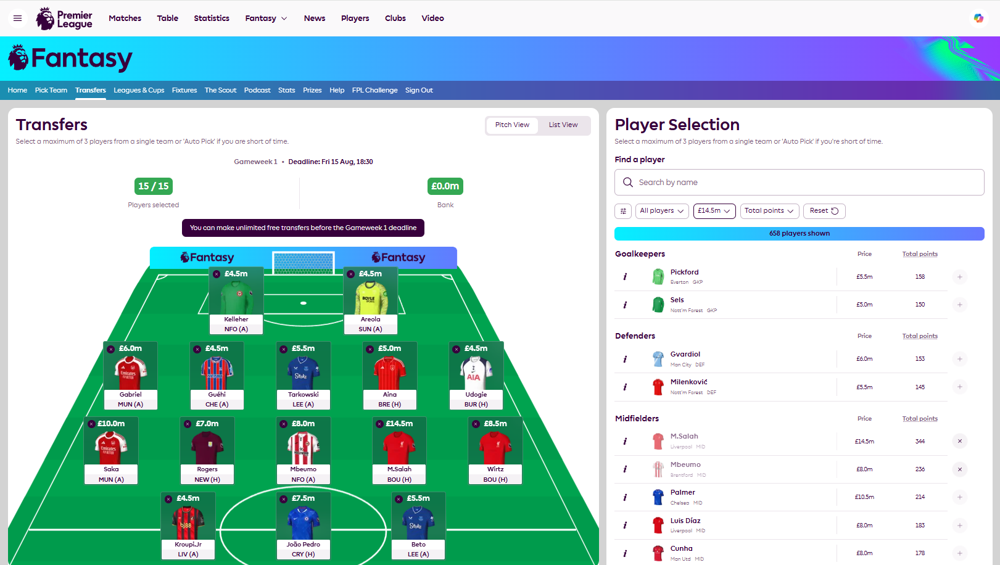

# FPL Restyle

A Chrome extension that enhances the Fantasy Premier League website with custom themes and improved UI. This extension restyles various pages of the FPL website to provide a better user experience.

## Examples

### My Team Page

*The restyled My Team page with reversed column layout and improved visual hierarchy*

### Transfers Page

*Enhanced transfers interface with custom styling and improved user experience*

## Installation & Setup

### Prerequisites

- Google Chrome browser
- A Fantasy Premier League account (for testing)

### Local Development Setup

#### Option 1: Download from GitHub (Recommended for most users)

1. **Download the extension files**
   - Go to the GitHub repository page
   - Click the green "Code" button
   - Select "Download ZIP"
   - Extract the ZIP file to a folder on your computer
   - You should now have a folder called `FplRestyle` (or similar)

#### Option 2: Using Git (for developers)

1. **Clone the repository**
   ```bash
   git clone <repository-url>
   cd FplRestyle
   ```

2. **Load the extension in Chrome**
   - Open Chrome and navigate to `chrome://extensions/`
   - Enable "Developer mode" by toggling the switch in the top-right corner
   - Click "Load unpacked"
   - Select the `FplRestyle` folder containing the extension files

3. **Verify installation**
   - The extension should appear in your extensions list
   - The extension should be enabled

## Testing the Extension

### Basic Testing

1. **Navigate to Fantasy Premier League**
   - Go to [https://fantasy.premierleague.com](https://fantasy.premierleague.com)
   - Log in to your FPL account

2. **Test My Team Page**
   - Navigate to "My Team" page
   - You should see changes like:
     - Reversed column layout (pitch on the right, team info on the left)
     - Horizontal header with title, gameweek info, and team value
     - Light gray background behind tiles

3. **Test Navigation**
   - Navigate between different pages (Leagues, Transfers, etc.)
   - The extension should automatically apply appropriate styles
   - Check the browser console for "FPL Restyle" messages

## Development

### File Structure

```
FplRestyle/
├── manifest.json      # Extension configuration
├── content.js         # Main content script with dynamic styling
├── content.css        # CSS template (reference only)
└── .github/           # GitHub templates
    └── pull_request_template.md
```

### Making Changes

1. **Edit Styles**
   - Modify the `styles` object in `content.js`
   - Add new page-specific styles as needed
   - Update the `injectStylesForCurrentPage()` function for new URL patterns

2. **Test Changes**
   - Save your changes
   - Go to `chrome://extensions/`
   - Click the refresh icon on the FPL Restyle extension
   - Navigate to the FPL website to test your changes

3. **Debug Issues**
   - Use Chrome DevTools to inspect elements
   - Check the console for error messages
   - Verify CSS selectors are targeting the correct elements

### Adding New Pages

To add styling for a new FPL page:

1. Add a new style block to the `styles` object in `content.js`:
   ```javascript
   const styles = {
     // ... existing styles ...
     newPage: `
       /* Your CSS styles here */
     `
   };
   ```

2. Update the `injectStylesForCurrentPage()` function:
   ```javascript
   if (url.includes('/new-page') || url.endsWith('/new-page')) {
     injectCSS(styles.newPage);
     console.log('FPL Restyle: Applied New Page styles');
   }
   ```

## Troubleshooting

### Extension Not Working

1. **Check if extension is loaded**
   - Go to `chrome://extensions/`
   - Ensure "FPL Restyle" is enabled
   - Check for any error messages

2. **Verify permissions**
   - The extension needs access to `https://fantasy.premierleague.com/*`
   - Check if the site is accessible

3. **Clear cache and reload**
   - Hard refresh the FPL website (Ctrl+Shift+R)
   - Reload the extension in `chrome://extensions/`

### Styles Not Applying

1. **Check CSS selectors**
   - FPL may have updated their CSS classes
   - Use DevTools to inspect elements and find current selectors
   - Update the selectors in `content.js`

2. **Verify script injection**
   - Check the console for "FPL Restyle" messages
   - Look for the injected style element in the DOM

## Contributing

1. Create a feature branch
2. Make your changes
3. Test thoroughly on the FPL website
4. Submit a pull request using the provided template

## Support

For issues or questions, please create an issue in the repository. 